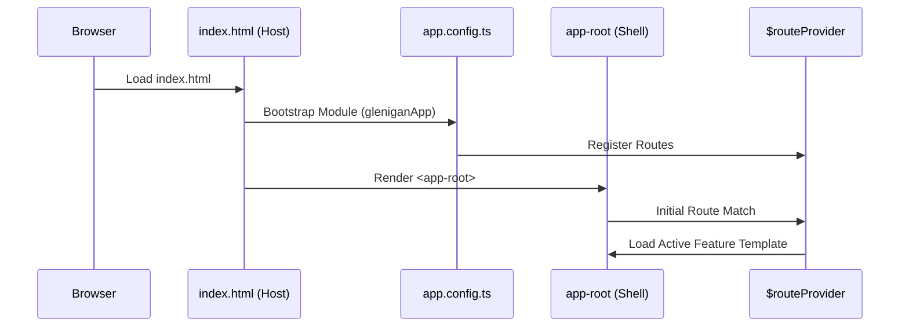
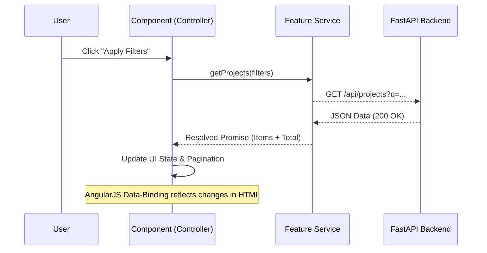

# Glenigan Projects Dashboard (Frontend)

This is the legacy **AngularJS 1.8.x** frontend application built to consume the FastAPI backend for the Glenigan take-home assignment.

## 🚀 How to Run Locally

### Prerequisites
- Node.js & `npm` (Required only for serving the static files and TypeScript compilation)
- Make sure backend is running on `http://localhost:8000`
- The accompanying **FastAPI Backend** must be running simultaneously on `http://localhost:8000`

### Setup Instructions
1. **Clone or extract** this repository.
2. **Open a terminal** and navigate into the root folder:
   ```bash
   cd glenigan_angularjs_frontend
   ```
3. **Install dependencies** (Used purely for `http-server` and TypeScript compilation):
   ```bash
   npm install
   ```
4. **Start the local server**:
   ```bash
   npx http-server -p 8080 -cors
   ```
5. **View the Application**: Open your browser and navigate to [http://localhost:8080](http://localhost:8080).

---

## 📂 Project Structure (Modern Strict Architecture)

The application follows a modular, feature-based directory structure to ensure scalability and maintainability.

```text
glenigan_angularjs_frontend/
├── src/
│   ├── index.html               # Main host HTML (Minimal Shell)
│   └── app/
│       ├── app.config.ts        # App configuration & Bootstrap
│       ├── app.routes.ts        # Main routing entry point
│       ├── core/                # Singleton services (e.g., ErrorHandler)
│       ├── shared/              # Global components, pipes, and directives
│       │   ├── components/      # Shared UI (Sidebar, Pagination)
│       │   └── pipes/           # Shared filters (DateFormat)
│       └── features/            # Business features (Organized by domain)
│           ├── projects/        # Project Dashboard (Logic, View, Routes)
│           └── companies/       # Companies Directory (Logic, View, Routes)
├── css/
│   └── style.css                # Global styling and CSS variables
├── package.json                 # Dependency management
└── tsconfig.json                # TypeScript configuration
```

---

## 🏗️ Application Architecture & Data Flow

This application is built using a **Modern Component-Based Architecture** within AngularJS 1.8.

### 1. Bootstrapping Flow
The application initialization follows a structured sequence from host to root component.



### 2. Feature Data Flow (Service-to-UI)
How data is requested, fetched, and rendered within a specific feature.




---

## 🛠️ Technical Implementation

- **TypeScript Integration**: All source code is written in TypeScript and compiled to the `dist/` directory.
- **Custom Filters**: A shared `dateFormat` filter ensures consistent date representation across the dashboard.
- **Error Handling**: A centralized `ErrorHandlerService` provides consistent feedback if API calls fail.

## 🤔 Assumptions & Tradeoffs
- **DRY Pagination**: Pagination logic was extracted from individual features into a shared component to ensure consistency and easier bug fixing.
- **Sticky Dropdown Fix**: Implemented defensive state management in controllers to prevent the "per page" selection from resetting during API refreshes.
